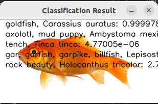
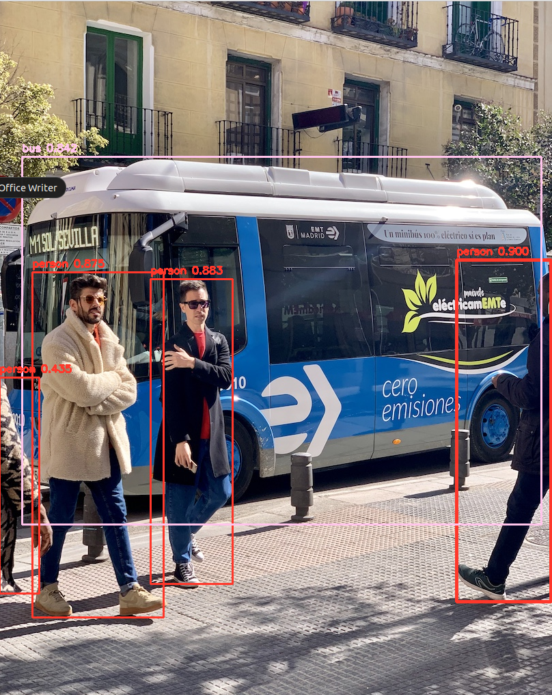
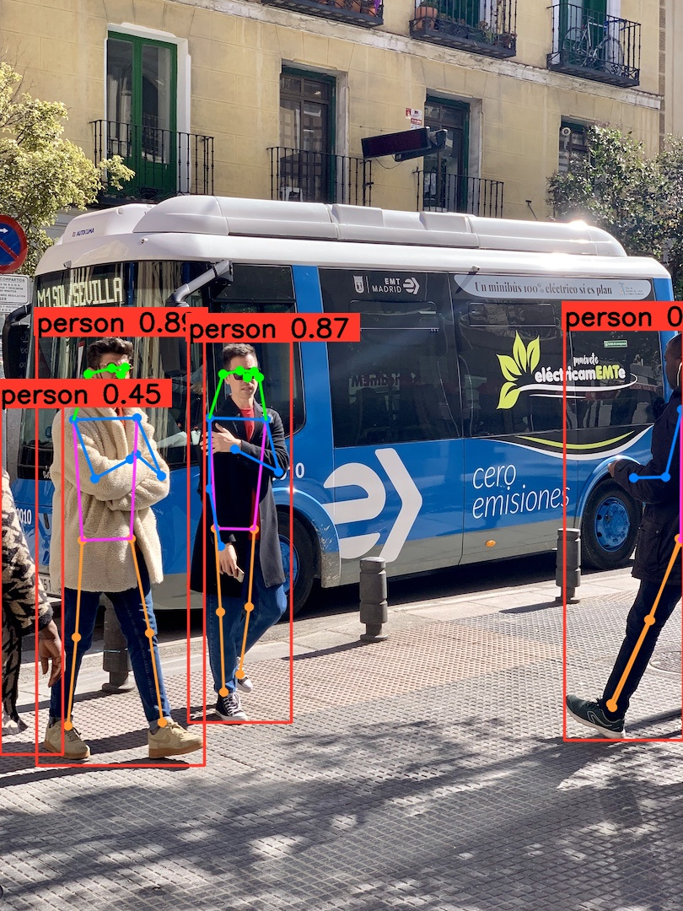
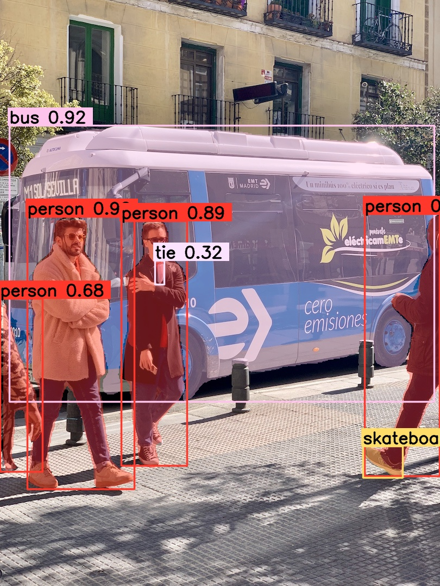
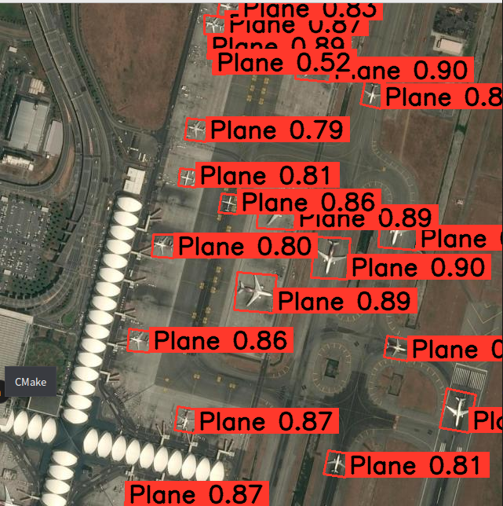

本文使用Opencv中的DNN模块对YOLOv8的所有类型模型,YOLOV9目标检测模型,YOLO11全系列模型进行了推理.

# **欢迎点赞！！！谢谢大家**

YOLOv8:分类,目标检测，旋转框检测，姿态，分割
YOLOv9:目标检测
YOLO11:分类,目标检测，旋转框检测，姿态，分割

封装了test类，可以进行单张图片进行推理

可以对摄像头读取到的视频进行推理

项目中的onnx模型是经过裁剪和修改过的 在yolov8中Obb和Seg和Pose都是先检测出来目标检测框然后在计算关键点或分割的权重或者旋转角度 为了方便计算，我将计算obb中的旋转角度，Pose中关键点的计算，Seg中的的分割权重 分别都cat在了计算目标检测框的那个头的后边。 yolov9-t的模型可以使用yolov8的代码进行推理，他们的后处理结构一模一样。 

YOLO11为最新更新,他的部署代码和YOLOv8一模一样,按照v8的思路修改模型再使用v8的推理代码进行推理即可.

本项只需要安装opencv库即可使用,不需要安装其他第三方库.

效果展示:

图片分类:这里只展示概率最大的前5种类别

目标检测:

姿态:

图像分割:

旋转框:

